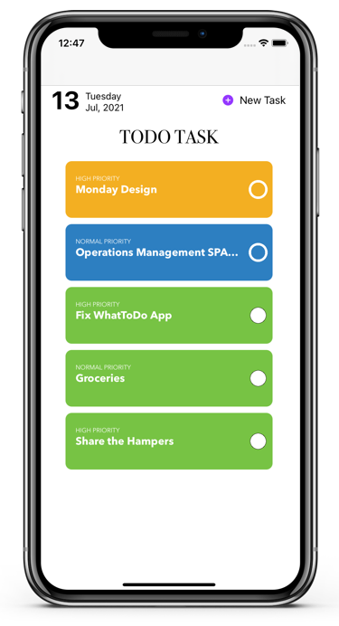

What to Do
===================


[](https://developer.apple.com/iphone/index.action)
[](https://developer.apple.com/swift)


An app to remind you what you have to do
## 🏃‍♂️ Getting Started

``` bash
git clone https://github.com/rifqialfaizi/WhatToDo.git
cd WhatToDo
open WhatToDo.workspace # or xed .

- Run (⌘ + R) or
- Test (⌘ + U)
```

## 👨🏻‍💻 What to Do Design
  <p float="left">
    
     
     
     
  </p>

Feature: 
- Date 
- Add, edit and delete list
- Move priority
- turn into green color when its done


## 🎉 Why I am building this?
1. Explore Core Data 🔥
2. Learn new thing


## 📱 Preview

